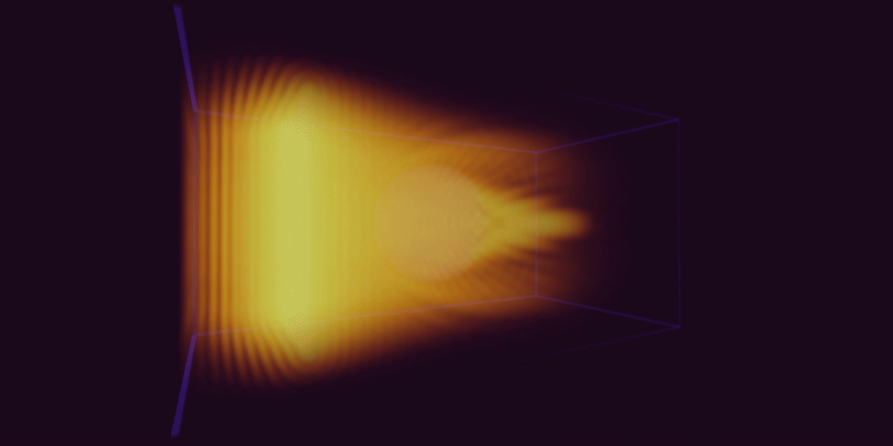
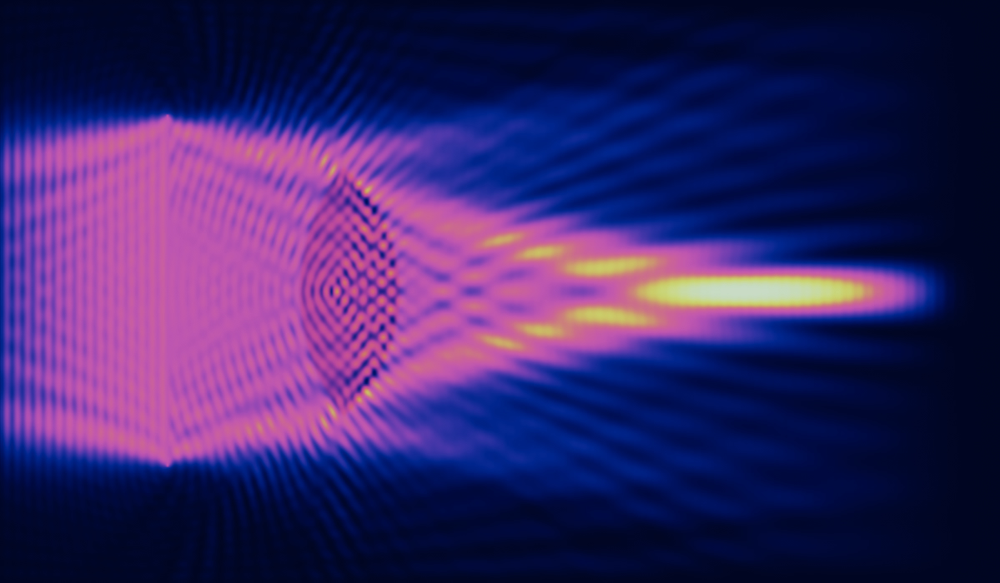

# wavesim2

wavesim2 lets you define the properties and logic for a 2D or 3D wave simulation and then actually does the simulation for you. On the GPU.

It's written in Python and comes with:

- GPU acceleration using a compute shader for the simulation and a ray marching fragment shader for rendering 3D volumes.

- Programmable excitations in the wave field

- Programmable camera POV

- Realtime preview

- PNG and JPEG export

- Sending custom data to the GPU (image pixel data, audio samples, etc.)

# Eye candy






# Running

wavesim2 uses [uv](https://github.com/astral-sh/uv) for package and project
management. It's super easy to learn and use (check out its `README.md`) so I
won't clutter this document with redundant instructions.

Once you got the packages all set up, run `main.py`.

# Editing

If you don't care about the implementation details, `config.py` is all you need to worry about. It already has 15 simulations for demonstration, but, of course, you can add your own.

Go to the last few lines in `config.py` to change which simulation `main.py` will run. For example, the following will tell `main.py` to use the first demo sim.

```python
selected_sim_params = sim1_basic
```

The code is easy to understand and modify (unless your brain has lost its functionality due to vibe coding everything).

# Supporting

<div align="center">
<a href='https://ko-fi.com/E1E81LFRKY' target='_blank'></a>
</div>
